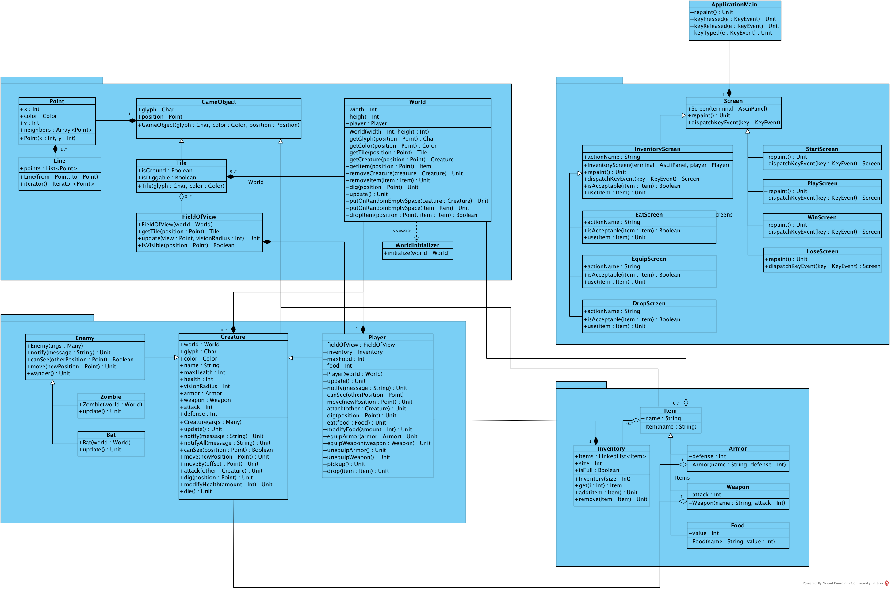
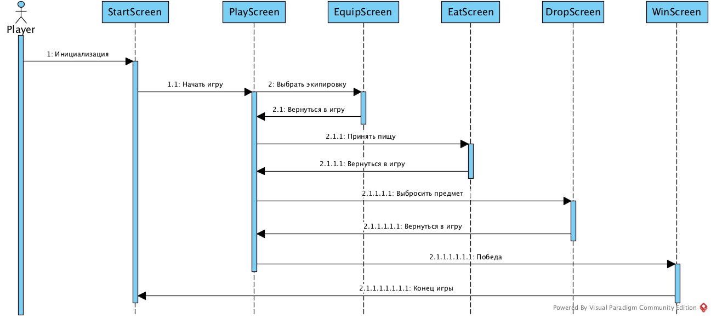
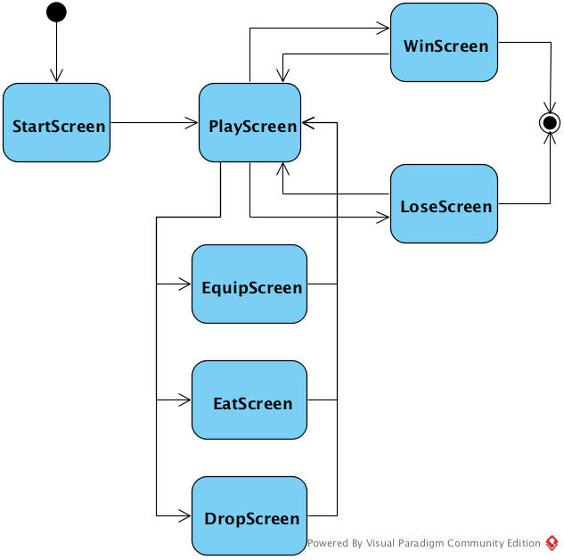

# Simple Roguelike

## Общие сведения о системе

### Игровые объекты:

`@` - игрок. Имеет среднее здоровье и атаку. Должен питаться.

#### Враги:   

`z` - зомби. Имеет высокое здоровье и атаку. Передвигается медленно. Если поблизости есть игрок, то атакует его.

`w` - летучая мышь. Имеют малое здоровье и атаку. Передвигается быстро и хаотично.
  
#### Броня:

`[` - light/medium/heavy armor. Различаются цветом.
        light - дает защиту 3, черный цвет.
		medium - дает защиту 5, серый цвет.
		heavy - дает защиту 7, белый цвет.
  
#### Оружие:

`)` - dagger/sword/claymore. Различаются цветом.
	    dagger - дает атаку 5, черный цвет.
	    sword - дает атаку 10, серый цвет.
	    claymore - дает атакуу 15, белый цвет.

#### Еда:

`f` - фрукт. Питательная ценность - 100.

`b` - хлеб. Питательная ценность - 200.

`m` - мясо. Питательная ценность - 300.
	    
#### Прочее:

`,` - камень. Не имеет применения.  

`G` - Грааль. Искомое сокровище.
  
### Управление:

`Enter` - подтвердить действие.

`Esc` - выйти из игры или вернуться к игре.

`Left`, `H` - перемещение влево.

`Right`, `L` - перемещение вправо.

`Up`, `K` - перемещение вверх.

`Down`, `J` - перемещение вниз.

`Y` - перемещение влево-вниз.

`U` - перемещение вправо-вниз.

`B` - перемещение влево-вверх.

`N` - перемещение вправо-вверх.

`D` - выбросить предмет из инвентаря.

`E` - съесть предмет из инвентаря.

`W` - экипировать предмет из инвентаря.

`P` - подобрать предмет под ногами.

`Q` - выйти из подземелься.

### Победа или поражение:

Цель игры - найти Грааль (`G`) и донести его до выхода.
Если здоровье игрока опустится до 0, то игра проиграна.

## Architectural drivers

В процессе создания игры были учтены следующие требования:  
+ Персонаж игрока, способный перемещаться по карте, управляемый с клавиатуры  
	+ Непосредственно стрелками (или дополнительной цифровой клавиатурой), не вводом команды  
+ Инвентарь персонажа, включающий элементы, влияющие на его характеристики, которые можно надеть и снять
+ Автоматически сгенерированная карта
+ Мобы, способные перемещаться по карте
+ Боевая система — движущиеся объекты, пытающиеся занять одну клетку карты, атакуют друг друга

## Роли и случаи использования

Игра рассчитана на проверяющего семинариста курса Software Design, читаемого в СПбАУ.
Проект несет образовательный характер.

Игрок управляет персонажем ролевой игры.
Перемещение по карте осуществляется при помощи клавиш `←↑↓→` / `hjkl`.
Для того, чтобы атаковать противника, достаточно, стоя рядом с ним, направиться в его направлении. 

Для управления инвентарем существуют 3 специализированных меню:
+ Меню управления экипировкой - вход по нажатию `W`, позволяет надевать или снимать предметы из инвентаря.
+ Меню приема пищи - вход по нажатию `E`, позволяет использовать еду.
+ Меню выбрасывания предметов - вход по нажатию `D`, позволяет выкидывать предметы на землю.

Выбор предмета на специализированном экране осуществляется по нажатию `a-z`.

Подбирать предметы можно по нажатию `P`.

Для победы необходимо найти Грааль (`G`), дойти до выхода (`<`) и выйти на поверхность (нажатием `q`). 

## Композиция и логическая структура

  

В игре имеется 4 группы сущностей - Экраны, Мир, Существа и Предметы.

+ Экраны - экраны для каждого игрового режима. В игре имеется стартовый экран, игрово экран,
экраны меню (снаряжения, еды, выбрасывания) и победный / проигрышный экран.
На игровом экране происходит обработка всей основной игровой логики.
На экранах меню обрабатывается специализированная игровая логика.
+ Мир - агрегирует в себе ландшафт, предметы, существ и игрока.
+ Существа - это одушевленные игровые объекты. Имеется абстрактнык класс Существо и его реализации - 
Игрок, котором управляет игрок и Противник игрока, действующий в соответствии со своей моделью поведения.
Противник игрока также является абстрактным классом. На данный момент имеются две реализации - 
Летучая мышь и Зомби, которые отличаются своим поведением, набором характеристик и внешним видом.
+ Предметы - это неодушевленные игровые, которые можно держать в инвентаре или положить на землю.
Все объекты можно разделить на 4 группы - Оружие, Броня, Еда и Остальное.
Оружие и броню можно надеть, чтобы улучшить свои характеристики. Еду можно съесть, чтобы избавиться от голода.
Среди остальных предметов на данный момент представлены Камень и Грааль. 
Первый не несет никакой пользы, а второй является частью условия победы.

Точка входа в игру - ApplicationMain. Она владеет текущим игровым экраном.

## Взаимодействия и состояние

### Диаграмма последовательностей

После инициализации игры игрок автоматически перенаправляется на стартовый экран.
Далее игрок начинает игру и переходит на игровой экран.
Игрок может выбрать экипировку, перейдя на специализированный экран выбора экипировки.
Игрок может съесть предмет из инвентаря, перейдся на специализированный экран приема пищи.
Игрок может выбросить предмет из инвентаря, перейдся на специализированный экран выбрасывания предметов.
После посещения любого из специализированных экранов игрок может вернуться обратно на игровой экран.
В случае победы игрок переходит на победный экран. С этого экрана можно перейти в самое начало - стартовый экран.

### Диаграмма конечных автоматов

Игра начинается со стартового экрана.
Далее игрок переходит на игровой экран, на котором отображен игровой мир.

С игрового экрана игрок может перейти в один из 3 экранов меню: 
меню снаряжения, меню еды или меню выбрасывания предметов.
После выполнения всех необходимых действий в меню игрок может вернуться на игровой экран.

Если здоровье игрока упадет до 0, то он перейдет в проигрышное состояние.
Если игрок найдет Грааль и донесет его до выхода, то он перейдет в выигрышное состояние.
